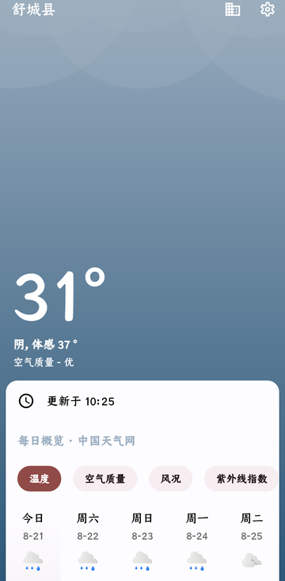
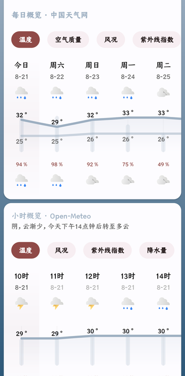
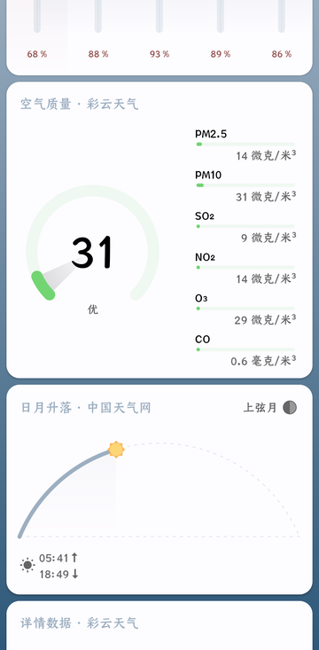
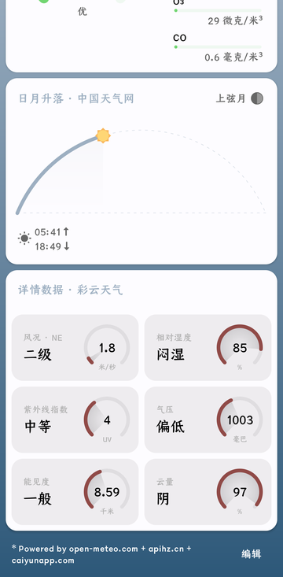
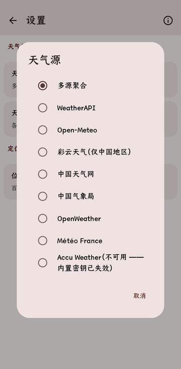

# GeometricWeather

中文 · [English](README_en.md)


一个 Android 天气应用，fork 自 [WangDaYeeeeee/GeometricWeather](https://github.com/WangDaYeeeeee/GeometricWeather)。

上游停更后，原版在新版 Android 上已无法编译、多数天气源也随接口变动失效。本分支把工具链搬到当前版本（Gradle 8 / AGP 8 / Kotlin 1.9 / compileSdk 35），换掉或修好了天气源，并持续修崩溃。**界面刻意保持原版风格**，不做重新设计。

## 截图

| 主界面 | 每日 / 小时 | 空气质量 |
| --- | --- | --- |
|  |  |  |

| 详情数据 | 天气源 |
| --- | --- |
|  |  |

截图取自 3.5.13（此后逐时块的领衔已改为小米天气）。留意卡片标题上的来源标注（「每日概览 · 中国天气网」「小时概览 · 小米天气」「空气质量 · 彩云天气」）—— 那是多源聚合在告诉你每一块数据是谁给的。

## 下载

前往 [Releases](https://github.com/huaaaajjj/GeometricWeather/releases) 下载最新的 `GeometricWeather-vX.Y.Z_pub.apk`。

发布包为本地构建并签名，每版都在真机上验证过（冷启动、联网取数、定位）才发布。**3.5.13 起可在应用内「关于 → 检查更新」自查新版本。**

版本号约定：末位递增是小修复或小改动，中间位递增是较大改动。

## 天气数据源

默认源是 **WeatherAPI**；想要最完整的数据请选 **多源聚合**。

| 数据源 | Key | 覆盖范围 | 数据量 | 状态 |
| --- | --- | --- | --- | --- |
| **多源聚合** | 内置 | 全球（中国境内最完整） | 16 天 · 384 小时 · AQI · 预警 | ✅ 推荐 |
| Open-Meteo | 免费无需 Key | 全球 | 16 天 · 384 小时 · AQI · 花粉（花粉仅欧洲；无预警） | ✅ |
| WeatherAPI | 内置 | 全球 | 3 天 · 72 小时 · AQI · 预警 | ✅ 默认 |
| 挪威气象局 | 免费无需 Key | 全球 | 约 11 天 · 约 90 点（无体感 / 日出日落） | ✅ |
| 小米天气 | 免费无需 Key | 全球（境内最全） | 中国 15 天 · 23 小时 · AQI · 预警 · 分钟级；境外 5 天 | ✅ |
| 彩云天气 | 内置（试用 Token） | 仅中国 | 3 天 · 48 小时 · AQI · 紫外线 | ✅ |
| 中国天气网 | 内置 | 仅中国 | 7 天 · 56 小时（逐 3 小时） | ✅ |
| 中国气象局 | 无需 Key | 仅中国 | 7 天 · 逐时（网页抓取） | ✅ |
| OpenWeather | 内置 | 全球 | 5 天 / 40 点（3 小时步长）· AQI | ✅ |
| Météo France | 内置 | 仅法国 | 15 天 · 73 小时 | ✅ |
| AccuWeather | 内置 Key **已失效** | 全球 | — | ❌ 不可用 |

AccuWeather 本是字段最全的源（15 天 / 逐小时 / 紫外线 / AQI / 分钟级降水 / 预警），但内置 Key 已过期返回 403。自备 Key 可在 `local.properties` 覆盖后恢复使用。

### 多源聚合是什么

同时请求多个源，按「谁擅长什么」分块取用，而不是简单地拿一家兜底：

- **小时预报** → 小米天气：约 23 小时逐小时（比国内源的 3 小时步长细），其后由 Open-Meteo 整段追加到 384 小时；应用内小时概览只展示最近 3 天
- **每日预报** → 中国天气网：境内地点用境内预报，覆盖 7 天；第 8 天起接 Open-Meteo，视野不缩短；它不给的降水概率、降水量与风，从别的源嫁接进这 7 天
- **空气质量与实时读数** → 彩云天气：实测中国 AQI，外加体感、湿度、气压、能见度（境外彩云无数据时落到 WeatherAPI / Open-Meteo）
- **预警** → 所有源的并集，WeatherAPI 最稳定

每块的来源会标在对应卡片标题上。任一源失败或超时都会自动落到下一个，只要有一家答上就能出预报——所以境外地点在中国源没有数据时，仍由 Open-Meteo 与 WeatherAPI 撑起完整预报。代价是每次刷新多几个网络请求。

## 与上游的区别

**工具链**

- Gradle 8.7 / AGP 8.4 / Kotlin 1.9.24 / compileSdk & targetSdk 35（minSdk 保持 21）
- RxJava 全部迁移到 Kotlin 协程；GreenDAO 迁移到 Room
- 可在当前 Android Studio 与 JDK 17 下直接编译

**数据源**

- 移除失效的源（QWeather、Visual Crossing）
- 新增中国天气网、中国气象局、WeatherAPI、Open-Meteo、挪威气象局、小米天气与多源聚合
- 修好彩云天气（去掉多余签名拦截、修 AQI 解析）、OpenWeather、Météo France

**修复与打磨**

- 一批崩溃：空安全兜底（坐标型源返回 null 时的连环崩溃）、Room 主线程访问、动态壁纸
- 定位：修中国区县级解析（彩云源曾把全国区县整体塌回地级市）、MIUI 兼容
- 界面：详情卡改成两列量规小卡、每日/小时概览锁到当前时间、界面文案补齐简繁中文

完整逐版记录见 [`AI_CONTEXT.md`](AI_CONTEXT.md) 的变更日志。

## 构建

需要 **JDK 17**。

```bash
./gradlew assemblePubDebug      # 调试版
./gradlew assemblePubRelease    # 发布版（签名 + R8）
./gradlew test                  # 全部 JVM 单元测试
```

产物在 `app/build/outputs/apk/<flavor>/<type>/`，文件名形如 `GeometricWeather-v3.5.13_pub.apk`。

三个 flavor 的差别只在定位与崩溃上报：

| Flavor | 定位 | 崩溃上报 | 说明 |
| --- | --- | --- | --- |
| `pub` | 系统定位（默认；有 Play Services 时走它）+ 可选高德 / 百度 SDK | Bugly | Releases 发布的就是这个 |
| `gplay` | 同上，但没打包高德 SDK（选高德会退回系统定位） | 无 | |
| `fdroid` | 只有系统定位与百度 IP 兜底 | 无 | 完全开源，无专有依赖 |

天气源的 Key 以 base64 内置在 `app/build.gradle`。要用自己的 Key，在 `local.properties` 里写同名属性即可覆盖，不必改代码。

## 开发说明

- [`AGENTS.md`](AGENTS.md) — 编码规范与审查清单
- [`CLAUDE.md`](CLAUDE.md) — 项目结构、构建命令、发布流程
- [`AI_CONTEXT.md`](AI_CONTEXT.md) — 当前状态、逐版变更日志、已知问题与待办

## 不做的事

- 不重新设计界面 —— 保持上游 3.3.6 的原版风格
- 不做应用内自动更新 —— APK 分发，下载安装留给用户
- 不迁移数据库 schema（锁定在 v63）
- 不接 FOSS Public Alert Server / 雷达图 / 气候平均值（Normals）—— 成本远超收益或需要新表，裁决见 [`docs/PORT_PLAN_breezy.md`](docs/PORT_PLAN_breezy.md)
- 不换序列化栈（kotlinx-serialization / 多模块拆分）—— 现有 Gson DTO、proguard keep 规则与 Hilt 依赖图全绑在一起，纯支出

## 已知限制

- **AccuWeather 内置 Key 已过期**，该源不可用（自备 Key 可恢复）
- 彩云天气用的是试用 Token：每日预报只到 3 天，无分钟级降水
- WeatherAPI 免费档只给 3 天预报
- 7 天以外的预报可靠性有限（各家皆然），别按天数选源；小时概览因此只展示最近 3 天
- 中国气象局的接口有 WAF，开发机上可能抓不到数据（真机正常）
- 数据库 schema 锁定在 v63，不做迁移
- minSdk 仍为 21

## 许可证

[LGPL-3.0](/LICENSE)，与上游一致。

## 致谢

- 原作者 [WangDaYeeeeee](https://github.com/WangDaYeeeeee/GeometricWeather)
- 上游的贡献者与译者（名单见应用内「关于」页）
