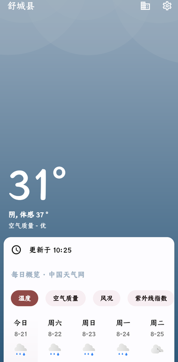
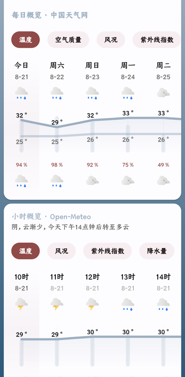
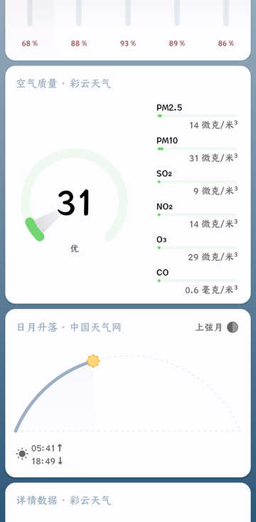
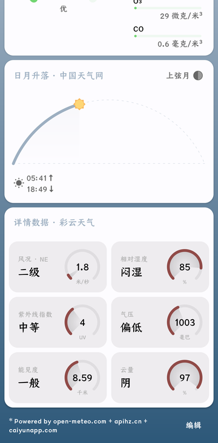
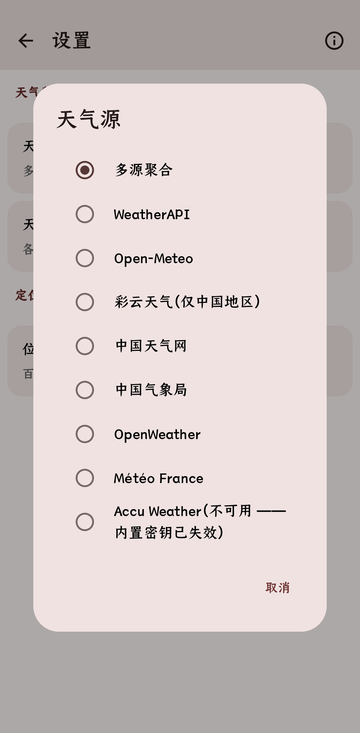

# 几何天气 使用说明

> 适用版本：3.6.x（撰写时以 **3.6.28** 为准，2026-10-02）。界面截图取自 `docs/screenshots/`。
> 几何天气（GeometricWeather）是一款开源 Android 天气应用，fork 自 [WangDaYeeeeee/GeometricWeather](https://github.com/WangDaYeeeeee/GeometricWeather) 并持续维护：修好了各天气数据源、支持到最新的 Android 版本，**界面刻意保持原版风格**，无广告、无追踪。

| 主界面 | 每日 / 小时 | 空气质量 |
| --- | --- | --- |
|  |  |  |

| 详情数据 | 天气源状态 |
| --- | --- |
|  |  |

## 目录

1. [下载与安装](#1-下载与安装)
2. [首次启动与权限](#2-首次启动与权限)
3. [主界面](#3-主界面)
4. [地点管理](#4-地点管理)
5. [搜索添加城市](#5-搜索添加城市)
6. [每日预报页](#6-每日预报页)
7. [预警页](#7-预警页)
8. [过敏原页](#8-过敏原页)
9. [天气数据源](#9-天气数据源)
10. [定位与位置服务](#10-定位与位置服务)
11. [设置](#11-设置)
12. [桌面小部件](#12-桌面小部件)
13. [通知](#13-通知)
14. [快捷设置磁贴](#14-快捷设置磁贴)
15. [动态壁纸](#15-动态壁纸)
16. [桌面快捷方式](#16-桌面快捷方式)
17. [后台刷新机制](#17-后台刷新机制)
18. [常见问题](#18-常见问题)
19. [已知限制](#19-已知限制)

---

## 1. 下载与安装

前往 [GitHub Releases](https://github.com/huaaaajjj/GeometricWeather/releases) 下载最新的 `GeometricWeather-vX.Y.Z_pub.apk` 直接安装（APK 分发，无应用内自动更新安装）。发布包均为本地构建签名，并经真机验证。

版本号约定：末位递增（3.6.27 → 3.6.28）是小修复，中间位递增是较大改动。每日构建以 **Prerelease（预发布）** 发布。

三个发行渠道的差别只在定位与崩溃上报，**Releases 发布的是 `pub` 渠道**：

| 渠道 | 定位方式 | 崩溃上报 |
| --- | --- | --- |
| `pub` | 系统定位（默认）+ 可选百度 / 高德 / 百度 IP SDK | Bugly |
| `gplay` | 同上，但无高德 SDK（选高德会退回系统定位） | 无 |
| `fdroid` | 只有系统定位与百度 IP 兜底 | 无（完全开源构建） |

**应用内检查更新**：设置 → 关于 → 检查更新。行尾开关可切换更新渠道：「仅正式版」/「包含预发布版（每日构建）」，默认仅正式版。

## 2. 首次启动与权限

首次启动会弹「获取位置信息」说明（仅一次）：应用需要在前台和后台获取位置以提供所在地天气。随后请求系统定位权限——

- **允许「仅使用时允许」**：打开应用时能定位刷新；小部件/通知的后台刷新会使用上次缓存的坐标。
- **允许「始终允许」**（系统会再弹一次后台定位说明）：后台刷新时也能重新定位，出差/旅行时小部件自动跟随。

各权限的用途：

| 权限 | 用途 | 不给的后果 |
| --- | --- | --- |
| 位置（前台/后台） | 定位「当前位置」城市 | 无法定位；可手动搜索添加城市 |
| 通知 | 常驻天气通知、预警/预报/降水提醒 | 收不到任何天气通知（Android 13+ 需手动允许） |
| 忽略电池优化（可选） | 保证后台定时刷新与小部件更新可靠 | 小部件可能更新不及时，详见[后台刷新机制](#17-后台刷新机制) |
| 读取外部存储（可选） | 小部件「文字颜色 = 自动」按壁纸亮度判断 | 该选项退化为手动指定颜色 |

不授权定位也能完整使用：在地点管理页用搜索添加任意城市即可。

## 3. 主界面

主界面自上而下由「头部温度块 + 一叠卡片 + 页脚」组成，背景是随实时天气与昼夜变化的几何动画（雨、雪、云、晴、雷……各有专属动效）。

**基本操作**

- **下拉刷新**：手动更新当前城市天气（定位 + 数据）。
- **左右滑动**：切换到上一个/下一个城市，滑动过半时背景会实时预览目标城市的天气。顶部圆点指示器显示当前位置与城市总数（仅有多于 1 个城市时显示）。
- **顶部栏**：标题为当前城市名；右上角菜单两项——「地址管理」（进入地点管理页）、「设置」。
- **进入应用自动刷新一次**当前城市；从后台切回前台也会按需刷新。
- **没有天气数据时**，点击列表任意位置即可触发刷新。

### 3.1 温度块（头部）

- 大号温度（带数字滚动动画）；
- 天气文本行：「天气描述, 体感 xx°」；
- 第三行：空气质量等级（如「优」）；无空气质量数据时显示风况描述；
- 「更新于 hh:mm」刷新时间行；
- 若城市时区与手机不同（如境外城市），另有一行该城市的**当地时间**实时时钟。

温度块在滚动时保持钉住，直到预警卡（或第一张卡片）顶上来一起滚走。

### 3.2 预警卡

有气象预警时显示（标题「预警」）。每条预警一页，多条预警可左右滑动翻页；点击任意一页进入[预警页](#7-预警页)并定位到该条。

### 3.3 降水概览卡（分钟级降水）

标题「降水概览」，柱状图展示未来两小时内的分钟级降水预报，标题行是一句动态播报（「约 12 分钟后开始降水」「未来两小时持续有降水」「约 5 分钟后雨渐停」等），每分钟自动更新。整个预报窗口内无降水时，卡片自动隐藏。分钟级数据依赖数据源（多源聚合在中国区由小米供数；见[数据源](#9-天气数据源)）。

### 3.4 每日概览

可横滑的温度趋势图，竖屏一屏约 5 天。顶部标签（由设置「每日趋势顺序」决定，见[外观](#116-外观)）：

**温度 / 空气质量 / 风况 / 紫外线指数 / 降水量** —— 点标签切换图线；点某一天进入该天的[每日预报页](#6-每日预报页)。今天的一列显示「今天」。

卡片标题下的简述与标题后缀标注了这块数据来自哪个源（如「每日概览 · 中国天气网」），可在卡片显示管理页关闭。

### 3.5 小时概览

从当前小时开始、最多展示 3 天的逐小时趋势图（更远的小时各家预报可靠性有限，故不再展示）。标签：**温度 / 风况 / 紫外线指数 / 降水量**。点某小时弹出详情对话框：天气 + 温度、体感温度、降水量、降水概率；点天气图标还能播放该天气的图标动画。

### 3.6 空气质量

大圆环显示 AQI 指数与等级，下方逐行列出 PM2.5 / PM10 / SO₂ / NO₂ / O₃（μg/m³）与 CO（mg/m³），只显示数据源提供的项。

### 3.7 过敏原

按天翻页（ViewPager），每页四项：**草 / 豚草 / 树 / 霉菌**，显示「指数 - 描述」并按等级着色，单位为 /米³。点击整卡进入[过敏原页](#8-过敏原页)。数据仅部分地区提供（见[已知限制](#19-已知限制)）。

### 3.8 日月升落

月相图 + 月相名称，太阳弧与月亮弧动画（日/月当前位置实时对应），日出↑ 日落↓、月升↑ 月落↓ 时间。当天没有月出或月落的日子会隐藏月亮半边（天文实况，约每个朔望月各一次）。

### 3.9 详情数据

两列网格小卡，每块 = 名称 + 文字评级（+ 圆环仪表数值）：

| 小卡 | 显示内容 |
| --- | --- |
| 风况 | 蒲福风级描述 + 风向 + 风速（按设置的速度单位） |
| 相对湿度 | 干燥/舒适/潮湿/闷湿 + 百分比 |
| 紫外线指数 | 等级 + UV 数值 |
| 气压 | 偏低/正常/偏高 + 数值（按设置的气压单位） |
| 能见度 | 很差/较差/一般/通透 + 距离（按设置的距离单位） |
| 露点 | 露点温度 |
| 云量 | 晴/少云/多云/阴 + 百分比 |
| 云高 | 云底高度 |

### 3.10 页脚与「编辑」

页脚一行「Powered by 数据源」（可在卡片显示管理里关掉），以及 **「编辑」按钮 → 卡片显示管理页**：可增删卡片并拖拽排序（共 6 张可选：每日概览、小时概览、空气质量、过敏原、日月升落、详情数据），页顶还有「显示数据来源」开关（控制卡片标题的来源后缀与页脚署名）。

### 3.11 手势速查

| 操作 | 效果 |
| --- | --- |
| 下拉 | 刷新当前城市 |
| 左右滑 | 切换城市（背景实时预览） |
| 点预警卡 / 降水卡标题下播报 | 预警卡 → 预警页 |
| 点每日概览某天 | 打开该天每日预报页 |
| 点小时概览某小时 | 弹出该小时详情 |
| 点过敏原卡 | 打开过敏原页 |
| 点页脚「编辑」 | 卡片显示管理页 |
| 无数据时点列表 | 触发刷新 |

## 4. 地点管理

**入口**：主界面顶部菜单「地址管理」；平板上为常驻侧栏。

页面顶部是搜索条（放大镜图标，点进搜索页）+ 右侧独立的**「添加当前位置」**定位按钮（添加/恢复「当前位置」城市，提示「收藏成功」；已存在定位城市时按钮隐藏）。

**列表项**：天气图标、城市名（定位城市显示「当前位置」）、天气文本与温度、位置描述，底部一行数据源署名；当前城市卡片描边高亮。

**操作**

| 操作 | 效果 |
| --- | --- |
| 点击某城市 | 切换为当前显示的城市并回到天气页 |
| 按住右侧把手拖动 | 调整城市顺序（顺序影响主界面滑动次序与小部件取数，见[小部件](#12-桌面小部件)） |
| 右滑某城市 | 删除（仅剩一个城市时不可删）；删除后可点「取消」撤销 |
| 左滑普通城市 | 开/关「常驻位置」，见下 |
| 左滑「当前位置」 | 打开「数据提供商」选择页 |

**常驻城市是什么**：把某城市（如家乡）设为常驻后，当你的实际位置就在它附近（与「当前位置」定位结果接近）时，它会在主界面城市列表、桌面快捷方式、多城市小部件中**自动隐藏**（避免与当前位置重复显示），离开后又自动出现。应用的官方说明：「常驻城市的天气将会根据您当前的位置来进行显示和隐藏。例如将家乡设置为常驻城市后，可以在旅途中查看家乡天气，而在回家后，家乡的天气数据将被当前位置替代并进行隐藏。」

## 5. 搜索添加城市

进入方式：地点管理页顶部搜索条。

- 输入并按搜索键发起搜索；结果项显示地点名、位置详情与数据源署名；右侧滚动条颜色跟随首个可见项的源。
- **点击结果**：已在收藏中提示「地址已存在」；否则添加并返回主界面，提示「收藏成功」。新城市默认使用全局设置的天气源（多源聚合），可对「当前位置」单独换源（见地点管理左滑）。

## 6. 每日预报页

**入口**：每日概览卡点某一天；小部件点某一天；通知直达。

顶栏标题「M月d日 星期X」+ 农历（中文界面），副文字「今天」或「n/总天数」。**左右滑动按天翻页**。每天的内容分「白天」「夜间」两大段（3 列网格）：

- 概览文字与风况；
- 温度：体感温度、阴面体感、地表温度、风寒温度、湿球温度、度日温度；
- 降水量：总量、雨、雪、冰、暴风雨；降水概率；降水时长；
- 之后是「详情数据」段（有数据才显示）：日月升落、空气质量、过敏原、紫外线指数；最后为日晒时长。

## 7. 预警页

**入口**：主界面预警卡；预警通知（点击直达预警列表）。

列出当前城市所有气象预警：加粗的预警标题 + 发布时间 + 正文。从预警卡进入时自动滚动到对应那条并用主题色高亮闪烁提示。

## 8. 过敏原页

**入口**：主界面过敏原卡。

按天一张卡，2×2 四项：**草 / 豚草 / 树 / 霉菌**，每项为等级着色圆点 + 「指数 - 描述」，单位固定 /米³（每立方米颗粒数）。数据来自 Open-Meteo 空气质量端点，**仅欧洲等部分地区提供**；第 8 天起各档无数据的行会显示成「0 /米³ - null」（已知显示瑕疵，忽略即可）。

## 9. 天气数据源

在 **设置 → 数据提供商 → 天气源** 中切换，共 11 个可选源（默认**多源聚合**）：

| 数据源 | Key | 覆盖范围 | 数据量 |
| --- | --- | --- | --- |
| **多源聚合**（默认，推荐） | 内置 | 全球（中国境内最完整） | 16 天 · 384 小时 · AQI · 预警 |
| Open-Meteo | 免费 | 全球 | 16 天 · 384 小时 · AQI · 花粉（花粉仅欧洲） |
| WeatherAPI | 内置 | 全球 | 3 天 · 72 小时 · AQI · 预警 |
| 挪威气象局 | 免费 | 全球 | 约 11 天 · 约 90 小时点（无体感/日出日落） |
| 小米天气 | 免费 | 全球（境内最全） | 中国 15 天 · 23 小时 · AQI · 预警 · 分钟级；境外 5 天 |
| 彩云天气 | 内置试用 Token | 仅中国 | 3 天 · 48 小时 · AQI · 紫外线 |
| 中国天气网 | 内置 | 仅中国 | 7 天 · 56 小时（3 小时步长） |
| 中国气象局 | 免费 | 仅中国 | 7 天 · 逐时（网页抓取） |
| OpenWeather | 内置 | 全球 | 5 天 / 40 点（3 小时步长）· AQI |
| Météo France | 内置 | 仅法国 | 15 天 · 73 小时 |
| AccuWeather | 内置 Key 已失效 | — | ❌ 当前不可用（选项中会标注） |

### 多源聚合是什么

同时请求多个源，按「谁擅长什么」分块取用，而不是简单拿一家兜底：

- **小时预报** → 小米天气约 23 小时逐小时，其后由 Open-Meteo 整段追加到 384 小时（应用内小时概览只展示最近 3 天）；
- **每日预报** → 中国天气网（境内 7 天），第 8 天起接 Open-Meteo 到 16 天；它缺的降水概率/降水量/风从别的源嫁接；
- **空气质量与实时读数** → 彩云天气（实测中国 AQI + 体感、湿度、气压、能见度），境外彩云无数据时落到 WeatherAPI / Open-Meteo；
- **预警** → 所有源预警的并集。

每块的来源标在对应卡片标题上（「显示数据来源」开关可关）。任一源失败或超时都会自动落到下一个源，只要有一家答上就能出预报——境外地点在中国源无数据时由 Open-Meteo 与 WeatherAPI 撑起预报。代价是每次刷新多几个网络请求。

### 天气源可用性页

**设置 → 数据提供商 → 天气源可用性**（或管理页左滑「当前位置」进入）——点「实测刷新」会对 11 个源逐个真实联网检测（固定测试坐标），以表格展示每个源是否可用、每日天数、逐小时点数、有无体感/UV/气压/湿度/降水/AQI/预警/日出等，用于自己判断该选哪个源。

> **注意**：切换天气源会清除全部城市的旧天气缓存并把所有城市改绑新源，切换后需刷新一次。

## 10. 定位与位置服务

**设置 → 数据提供商 → 位置服务**（pub 渠道）四选一：

| 位置服务 | 说明 |
| --- | --- |
| 原生接口（默认） | 系统 GPS/网络定位 + 上次已知位置兜底，最可靠 |
| 百度定位 | 百度 SDK 定位，国内室内更准；个别机型/网络下 SDK 可能挂起（有 15 秒超时兜底） |
| 百度 IP 定位 | 免定位权限，按 IP 出城市级坐标，仅中国地区有效 |
| 高德定位 | 高德 SDK；**截至 3.6.28 发布包未配置高德 Key，选择后定位会失败并自动回退** |

fdroid 渠道只有「百度 IP 定位 / 原生接口」；gplay 渠道没有高德。**切换位置服务后需要重启应用**（应用会提示）。

**失败兜底**：每次定位最长等 15 秒。超时或失败时——若已有可用坐标（缓存），用缓存坐标继续刷新天气并弹「定位失败」提示；完全没有坐标才回退到内置默认城市（北京）。所以「弹定位失败但天气照常更新」是设计行为。

**定位失败排查**：主界面弹「定位失败」时点「帮助」，对话框提供四项：

1. 检查位置权限（跳系统设置）；
2. 开启位置信息（跳系统开关）；
3. 选择位置信息提供商（跳位置服务设置）；
4. 手动添加城市并删除当前定位（不用定位，改手动管理）。

## 11. 设置

入口：主界面菜单「设置」；设置页右上角 ⓘ 可进「关于」。

### 11.1 基础

| 设置 | 说明 | 默认 |
| --- | --- | --- |
| 后台纯净 | 开 = 只用系统调度的后台任务，无常驻服务（省电，但受系统省电策略影响）；关 = 常驻前台服务保证更新（会出现常驻通知）。详见[后台刷新机制](#17-后台刷新机制) | 开 |
| 推送预警通知 | 有新气象预警时推送 | 开 |
| 推送降水预报 | 未来 4 小时内可能降水时提醒（每天最多一次） | 关 |
| 自动刷新频率 | 半小时 ~ 6 小时共 12 档 | 1.5 小时 |
| 暗色模式 | 自动（按当地昼夜）/ 跟随系统 / 亮色 / 暗色 | 自动 |
| 动态壁纸 | 跳转系统壁纸选择器，见[动态壁纸](#15-动态壁纸) | — |
| 数据提供商 | 天气源与位置服务设置 | — |
| 单位 | 各项计量单位 | — |
| 外观 | 图标、卡片、动画、语言 | — |

### 11.2 预报

- **定时预报(今日天气)**：在指定时间（默认 07:00）推送一条今日天气预报通知；
- **定时预报(明日天气)**：在指定时间（默认 21:00）推送明日预报通知。两项默认均关，时间可自定。

### 11.3 小部件

- **一周天气图标样式**：一周/多日图标自动跟随昼夜、固定白天或固定夜间（默认自动）；
- **Minimal图标**：小部件与通知改用简约线条图标（默认关）；
- 已添加到桌面的小部件会出现对应配置入口（今日 / 一周 / 时钟系列 / 纯文字 / 趋势 / 多个城市，共 11 种）。**已知小瑕疵：这些入口标题目前显示为英文键名**（如 `widget_day` = 今日、`widget_week` = 一周、`widget_clock_day_details` = 时钟+今日(详情)、`widget_text` = 纯文字、`widget_trend_daily` = 每日趋势、`widget_multi_city` = 多个城市，以此类推），点进去即是对应配置页。

### 11.4 通知

| 设置 | 说明 | 默认 |
| --- | --- | --- |
| 开启天气通知 | 常驻天气通知总开关 | 关 |
| 通知风格 | 原生 / 多城市 / 每日概览 / 小时概览（详见[通知](#13-通知)） | 每日概览 |
| 将温度作为通知小图标 | 状态栏小图标显示温度数字而非天气图标 | 关 |
| 体感温度 | 温度小图标/通知里用体感温度替代实测温度（**中文界面此项标题暂显示英文 "Use Feels Like temperature"**） | 关 |
| 天气通知可被清除 | 允许滑掉常驻通知（默认不可清除） | 关 |

### 11.5 单位

| 项 | 选项 | 默认 |
| --- | --- | --- |
| 温度 | ℃ / ℉ / K | ℃ |
| 距离 | 千米 / 米 / 英里 / 海里 / 英尺 | 千米 |
| 降水 | 毫米 / 厘米 / 英寸 / 升/米² | 毫米 |
| 压力 | 毫巴 / 千帕 / 百帕 / 标准大气压 / 毫米汞柱 / 英寸汞柱 / 千克力/米² | 毫巴 |
| 速度 | 千米/时 / 米/秒 / 节 / 英里/时 / 英尺/秒 | 米/秒 |

### 11.6 外观

| 设置 | 说明 | 默认 |
| --- | --- | --- |
| 图标风格 | 选择图标包：内置「几何天气」与 Pixel；也支持设备上安装的第三方图标包；列表每行可「预览」，底部有获取更多入口 | 几何天气 |
| 卡片显示 | 主页卡片增删与排序（同页脚「编辑」） | 6 张全开 |
| 每日趋势顺序 | 每日概览的图线项与顺序（温度/空气质量/风况/紫外线/降水量） | 按此顺序全开 |
| 小时趋势顺序 | 小时概览的图线项与顺序（温度/风况/紫外线/降水量） | 按此顺序全开 |
| 趋势图横线 | 趋势图是否绘制横向参考线 | 开 |
| 交换日间夜间温度 | 「7° / 3°」↔「3° / 7°」显示顺序 | 关 |
| 重力感应 | 卡片视差等重力效果（也影响动态壁纸） | 开 |
| 列表动画 / 组件动画 | 各类动画开关 | 开 |
| 语言 | 跟随系统 + 23 种语言，切换后需重启应用 | 跟随系统 |

### 11.7 关于

应用图标 + 版本号，以及：

- **检查更新**（含「仅正式版 / 包含预发布版」渠道切换）；
- GitHub（原作者 / 本分支）、E-mail；
- 捐赠（支付宝 / 微信付款码）；
- 贡献者与译者名单。

## 12. 桌面小部件

共 **13 种**，长按桌面 → 添加小部件 → 几何天气。所有小部件的**数据取城市列表第 1 个城市**——想让小部件显示某个城市，把它在地点管理里拖到第一位即可。支持添加到**桌面和锁屏**（锁屏分类仅旧版系统生效）。

| 小部件 | 起始尺寸 | 内容 |
| --- | --- | --- |
| 今日 | 3×1 | 天气图标 + 实时温度/天气 + 副标题，10 种视图样式 |
| 一周 | 4×1 | 5 天（可选 3 天）列表：星期/图标/温度区间 |
| 今日 + 一周 | 4×2 | 上半今日、下半一周 |
| 时钟 + 今日 (水平排列) | 4×1 | 左时钟右天气 |
| 时钟 + 今日 (详情) | 4×2 | 时钟 + 今日温度/体感/湿度或 AQI/风况/农历 |
| 时钟 + 今日 (垂直排列) | 3×2 | 竖排时钟 + 天气 |
| 时钟 + 今日 + 一周 | 4×2 | 时钟 + 今日 + 5 天预报 |
| 纯文字 | 2×1 | 日期 + 天气文本 + 大号温度 |
| 每日趋势 | 4×2 | 5 天温度曲线（含昨日、图标、降水概率） |
| 小时趋势 | 4×1 | 未来数小时趋势图 |
| 多个城市 | 4×1 | 最多 3 个城市横排（城市名/图标/温度） |
| Material You - 实时 | 约 2×2 | 动态取色主题，当前天气，无配置页 |
| Material You - 预报 | 4×3 | 动态取色，自适应布局，今日/5 小时预报，无配置页 |

### 配置页

添加小部件时（或设置 → 小部件里点已添加的小部件）进入配置页，以当前壁纸为背景实时预览。公共选项：

| 选项 | 取值 |
| --- | --- |
| 视图样式（今日类） | 矩形 / 对称 / 平铺 / Mini / Nano / Pixel / 竖版 / 奥利奥 / 奥利奥（Google字体）/ 仅温度 |
| 卡片背景 | 无卡片 / 日间夜间模式 / 亮色卡片 / 暗色卡片 |
| 卡片透明度 | 0–100 滑杆 |
| 隐藏副标题 / 副标题数据 | 更新时间 / 空气质量（部分地区无效）/ 风况 / 体感温度 / 农历（仅中文）/ **自定义** |
| 文字颜色 | 白色文字 / 暗色文字 / 自动（按壁纸亮度，需存储权限） |
| 文字大小 | 100% 基准的滑杆 |
| 时钟字体（时钟系列） | light / normal / black / 模拟表盘 |
| 隐藏农历（时钟系列） | 仅中文环境显示此开关 |
| 文字右对齐（纯文字） | 开/关 |

**自定义副标题模板**支持占位符：`$cw$` 当前天气、`$ct$` 温度、`$at$` 体感、`$al$/$als$` 预警、`$0dw$`…`$4mp$` 未来 5 天各项、`$enter$` 换行等（配置页内列出全部关键字）。

### 点击行为

| 小部件 | 点击区域 → 跳转 |
| --- | --- |
| 今日 | 天气主体 → 主界面；Oreo 样式标题区、Pixel/农历时间区 → 系统日历 |
| 时钟系列 | 时钟区 → 系统时钟/闹钟；标题/日期区 → 日历；天气区 → 主界面 |
| 一周 / 今日+一周 / 时钟+今日+一周 | 每天一列可分别点击 → 主界面该天的每日预报 |
| 多个城市 | 每个城市块 → 主界面并切到该城市 |
| 趋势 / 纯文字 / Material You | 整块 → 主界面（纯文字日期区 → 日历） |

## 13. 通知

1. **常驻天气通知**（设置 → 通知 → 开启天气通知）：实时温度、天气、AQI 或风况、城市名与农历，点击进主界面。四种**通知风格**：
   - **原生**：系统标准样式，展开显示细节；
   - **多城市**：折叠显示第 1 城，展开最多再显示 3 城（共 4 城）；
   - **每日概览**：展开附未来 5 天预报列表；
   - **小时概览**：展开附未来 5 小时预报列表。
   默认常驻不可清除，可在设置中改为可清除。
2. **定时预报通知**（设置 → 预报）：今日/明日预报各一条，按设定时间推送（默认 07:00 / 21:00），带提示音与振动，内容为「白天 天气 温度 / 夜间 天气 温度」。
3. **预警通知**（默认开）：仅推送**新出现**的预警，标题为预警描述，多条预警分组显示，点击直达预警列表。
4. **降水提醒**（默认关）：未来 4 小时内或今日白天/夜间可能有降水时提醒（「未来几小时内可能出现降水 / 今日可能出现降水」），**每天最多一次**。
5. **后台运行通知**（仅关闭「后台纯净」时出现）：「正在后台运行以保持更新数据」；刷新期间另有「正在更新天气数据 (n/总数)」。

## 14. 快捷设置磁贴

下拉通知栏的快捷设置中可添加「Geometric Weather」磁贴：图标为第 1 个城市的简约天气图标、标签为该城市当前温度；点击收起通知栏并打开主界面。

## 15. 动态壁纸

**入口**：系统壁纸选择器（「动态壁纸」→ 几何天气），或 设置 → 动态壁纸 跳转。效果即应用内的 Material 天气动画全屏渲染为壁纸：随天气与昼夜变化的背景与粒子动效，支持高刷新率屏幕，跟随「重力感应」设置产生视差。

壁纸设置（在壁纸预览页的设置图标）：

- **天气**：自动（跟随第 1 个城市的实时天气）/ 晴 / 多云 / 阴 / 雨 / 雪 / 雨夹雪 / 冰雹等；
- **时间**：自动（跟随昼夜）/ 白天 / 夜间；
- **帧率**：30 / 60 / 90 / 120 / 144 Hz（自动裁剪到屏幕上限）。

## 16. 桌面快捷方式

长按应用图标弹出快捷方式（动态生成）：

- **刷新数据**：立即触发一次全部城市的后台刷新；
- 各城市快捷方式（最多至系统上限）：图标为该城市当前天气，点击直达该城市天气页。城市增删或天气刷新时自动重建。

## 17. 后台刷新机制

由 **设置 → 基础 → 后台纯净** 决定调度方式：

| | 后台纯净 = 开（默认） | 后台纯净 = 关 |
| --- | --- | --- |
| 机制 | WorkManager 周期任务（有网络时执行，失败自动退避重试） | 独立进程常驻前台服务，每分钟走表调度 |
| 特点 | 省电、无常驻通知；更新时机由系统统一调度，可能延迟 | 更新准时；出现「正在后台运行」常驻通知，耗电略高 |
| 定时预报 | 一次性任务，完成后自动续订次日 | 常驻服务在设定时刻触发 |

**小部件/通知不更新的排查顺序**：① 保持后台纯净关闭试试（最可靠）；② 系统设置里允许忽略电池优化 / 后台运行（MIUI 还需「自启动」与「后台弹出界面」权限）；③ 检查更新频率设置；④ 重启手机。关闭后台纯净时应用会引导授予通知分组与电池优化权限，按提示操作即可。

## 18. 常见问题

**Q：弹「定位失败」但天气还是更新了？**
正常。定位最长等 15 秒，失败后自动改用上次缓存的坐标继续刷新天气；完全没有坐标才回退到默认城市（北京）。若定位持续失败，按提示进「帮助」处理，或换一个位置服务（推荐原生接口；高德在当前发布包中无 Key、不可用）。

**Q：切换天气源 / 位置服务后数据没了或没生效？**
切换天气源会清空所有城市的旧缓存（属设计行为），刷新一次即可；切换位置服务需重启应用。

**Q：AccuWeather 选不了 / 报不可用？**
内置 Key 已过期，该源当前不可用，选项名中会标注。可在「天气源可用性」页实测其它源后改选。

**Q：每日概览的「昨天」气温没显示？**
昨日列数据来自本机保存的历史行（或 Open-Meteo 昨日分析场）。**更新到新版本后的第一天没有昨日历史，第二天起正常显示。**

**Q：小时概览为什么只显示 3 天？**
更远的小时预报各家可靠性都有限，应用刻意只展示最近 3 天；要看更远用每日概览（多源聚合到 16 天）。

**Q：过敏原卡不显示 / 显示「0 /米³ - null」？**
花粉数据仅欧洲等部分地区提供，没有数据的城市该卡不显示；且第 8 天起各档无数据，会显示成「0 /米³ - null」（已知显示瑕疵）。

**Q：预警卡 / 降水概览卡不见了？**
无预警时预警卡隐藏；未来两小时无降水时降水概览卡隐藏。分钟级降水数据多源聚合在中国区由小米供数，其它源可能没有。

**Q：检查更新说失败？**
需要能访问 GitHub（github.com）。国内网络不佳时多试几次或直接到 Releases 页下载。

**Q：语言切换后界面没变？**
切换语言后需重启应用（按提示操作）。

## 19. 已知限制

- **AccuWeather 内置 Key 已过期**，该源不可用；
- 彩云天气使用试用 Token：每日预报只到 3 天、无分钟级降水；
- WeatherAPI 免费档只给 3 天预报；
- 中国气象局接口有 WAF，个别网络环境可能取不到数据；
- Météo-France 的天气描述为源方原文（法语），未映射；
- 「体感温度」通知设置项与小部件配置入口标题在中文界面暂显示英文（`Use Feels Like temperature`、`widget_day` 等）；
- 过敏原页第 8 天起无数据的行显示为「0 /米³ - null」；
- 设置中未提供自定义 API Key 的界面（普通用户无法自备 Key）；
- 高德定位在当前 `pub` 发布包中未配置 Key，选择后必然失败并回退。

---

*本文档基于源码梳理（v3.6.28），项目主页：[huaaaajjj/GeometricWeather](https://github.com/huaaaajjj/GeometricWeather)。逐版变更见 [`AI_CONTEXT.md`](../AI_CONTEXT.md)，构建与开发说明见 [`CLAUDE.md`](../CLAUDE.md) 与 [`AGENTS.md`](../AGENTS.md)。*
